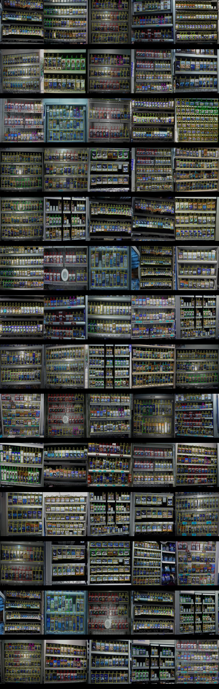

Faster-rcnn is a family of object detection architectures and models,This repository uses pretrained faster-rcnn model on COCO dataset for detect items in [grocery dataset]("https://github.com/gulvarol/grocerydataset").

---

**image2products.json:** This file contains predictions of the number of items present in per image.

**metrics.json:** This file contains scores of evaluation metrics (mAP,precision,recall).

### **Data preparation:** 
Data preparation completed in 4 steps:

1. convert csv annotation to pandas DataFrame and separate train and test DataFrames.
2. Fix images which is `rotated 180 degree clockwise and 90 degree counter clockwise`.
3. convert bounding boxes to float (because Faster-rcnn takes floats in bounding box).
4. Add 1 to all `categories` because i wand 0 to categorized as `is_crowd`(i fixed it later).

### **Augmentation:**  
I used `Horizontal flip with 0.3 probability,Random brightness Contrast with 0.5 probability, To Gray with 0.5 probability and vertical flip with 0.4 probability.` I used `PascalVOC` format for bounding box augmentation.

### **Detection network:** 
`FasterRCNN` with Resnet50 backbone. model is available in torchvision module.

**optimizer :** AdamW.

**learning rate scheduler:** StepLR

### **training parameters:**

* **batch size:** 4,
* **Learning rate:** 0.0001,
* **step-size:** 10,
* **epochs:** 15,
* **weight-decay:** 0.0001,
* **gamma:** 0.1

### **Evaluation:**

mean average precision calculated on `0.5` `iou-threshold`. 

## **Quick Start Examples**
---

`Python>=3.8.0` is required with all requirements.txt:

    $ cd product_detection_sudhanshu_singh
    $ pip install -r requirements.txt

## **Training:**

Run commands below to start train model,for training model takes preprocessed data thus `data preprocessing` automatically covered in this step. 

    $ python train.py --batch-size 4 --epochs 25 --step-size 9 --lr-rate 0.0001 --weight-decay 0.0001 --gamma 0.1

### **My prediction scores:**

    "mAP": 0.6902879417612586,
    "precision": 0.7323759327193174,
    "recall": 0.9036605018549191

### **Evaluation:**

If you have run train.py then you have got `weights` for `evaluate` trained model on test data.Run command below to start evaluation:

if you don't want to train the model then download weights from [here](https://drive.google.com/file/d/1cglT0TNmfDRSUYhjK67BPqCJ5OQWzZSv/view?usp=sharing)

    $ python evaluation.py --weights "saved_weights.pth" --iou-thres 0.5

### **Visualization:**

If you have `weights` then you can view predictions on test images:

    # if view prediction on test images
    $ python visualization.py --weights "saved_weights.pth" --view-predict
    #if view train images
    $ python visualization.py --view-train

**prediction output on test images:**

